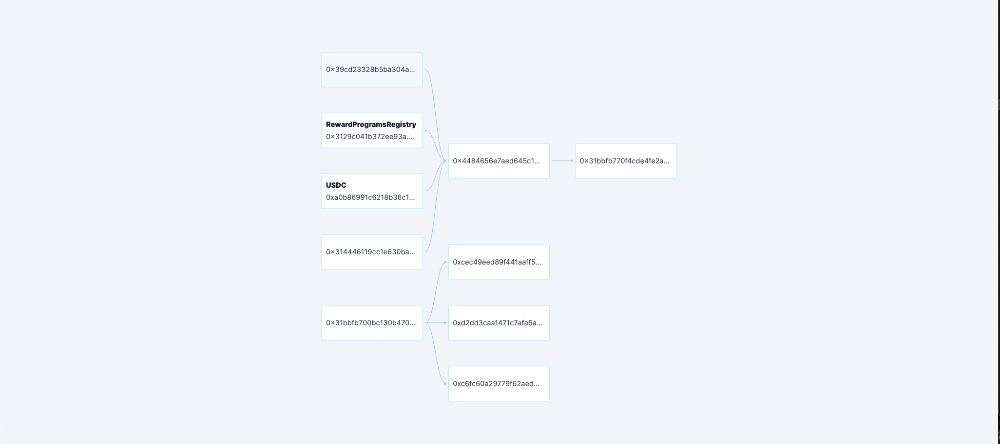

# Full-Stack Exercise - Hexgate

Hi!

The goal in this exercise is to design and develop a basic API server and a React page that presents an address funding flow graph.

In an address fund flow, address send or receive fund to each other addresses. In this exercise, we implement a basic
fund flow graph page that shows all transfers between different addresses.

## Your task

In this assignment you will write a basic fund flow graph page and an API server that serves data to this fund flow
graph page.

### webapp:
You can familiarize yourself with the [React web app template](/webapp) we prepared for you:

- [middleware](/webapp/src/middleware.ts) you need to redirect to the dashboard by default 
- [dashboard](/webapp/src/app/dashboard) is the page you need to use for your implementation, please don't forget to
  handle loading and error cases.
 - [useFundsFlow](/webapp/src/app/dashboard/hooks/useFundsFlow.ts) is the place you need to create the graph data, 
   - You should use [react-query](https://tanstack.com/query/v3/) to fetching the data, please use the [getFundingGraph](webapp/src/app/api/funding.ts) function. 
   - You should be implemented the graph with [react-flow](https://reactflow.dev/), please fill the empty components
     under [charts](webapp/src/app/components/charts)

- the code should be written in typescript.

## server

Implement an API server that will serve data for the fund flow graph page.

- No need to setup a real database to hold the data, please use this [data](/server/data.json)
- you need to implement the [route](/server/api/v1/funding/graph.py), please use paydentic.

the code should be written with typing.

#### The end goal is to have a graph that looks like the attached picture

## Submission

1. Open a public repository with the given code.
2. After implementing the exercise, push the code to the main branch.

## Questions

Feel free to reach out and ask any questions, at any time.